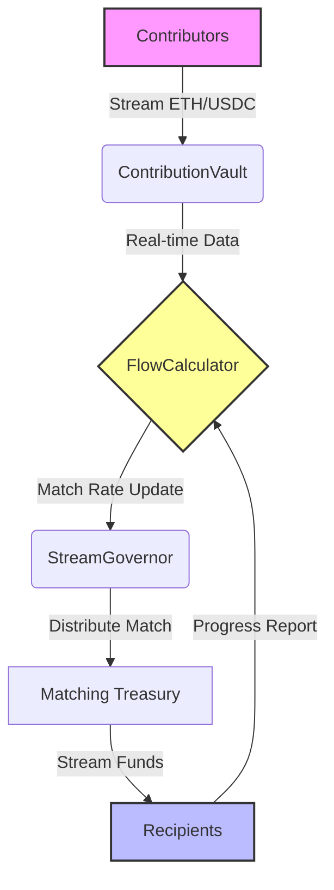

# 🚀 QuadStream: Real-Time Quadratic Funding Streams

> **One-line Pitch:** Streaming Quadratic Funding that aligns incentives, prevents grant draining, and ensures continuous contributor alignment through dynamic matching pools.

[](https://hackonomics.io)
[](https://opensource.org/licenses/MIT)
[](https://soliditylang.org/)
[](https://hardhat.org/)
[](https://docs.ethers.org/)

---

## 📖 Overview

**QuadStream** is a governance and treasury tool designed for DAOs and grant programs. It replaces traditional lump-sum Quadratic Funding (QF) rounds with **Superfluid-style payment streams**. By integrating real-time streaming with quadratic matching logic, QuadStream eliminates "hit-and-run" grant draining and mitigates Sybil attacks by requiring continuous contribution alignment.

If a contributor stops their stream, the matching multiplier for that project drops instantly across the network, ensuring funds are always flowing to active, aligned communities.

## 🛑 The Problem

Traditional Quadratic Funding mechanisms suffer from critical inefficiencies:
1.  **Grant-and-Ghost:** Contributors fund a project once, receive the lump-sum match, and disappear, leaving the project underfunded for the long term.
2.  **Sybil Vulnerability:** Static rounds allow attackers to farm matches with multiple wallets during a short window.
3.  **Liquidity Risk:** Lump-sum payouts can drain treasury reserves instantly, causing volatility in project sustainability.
4.  **Misaligned Incentives:** Once the grant is received, there is no financial incentive for the recipient to maintain momentum.

## ✅ The Solution

QuadStream introduces **Dynamic Streaming Quadratic Funding**:
*   **Continuous Alignment:** Funds stream over time. If a backer stops, the match rate adjusts immediately.
*   **Anti-Sybil:** The matching pool calculates rates based on the square of the sum of square roots of *current* stream magnitudes, not historical totals.
*   **Gas Efficient:** A dedicated `FlowCalculator` library handles non-linear math without hitting block gas limits.
*   **Governance Control:** The `StreamGovernor` manages the matching treasury and can pause streams during emergencies.

## 🏗️ Architecture



### Core Components

| Component | File | Description |
| :--- | :--- | :--- |
| **StreamGovernor** | `contracts/QuadGovernor.sol` | Manages the matching treasury, pauses streams, and updates global multipliers. |
| **ContributionVault** | `contracts/StreamVault.sol` | Holds individual backer funds and calculates their streaming rate. |
| **FlowCalculator** | `contracts/QFMath.sol` | Handles the $ \sum \sqrt{c_i} $ math efficiently to prevent gas overflows. |

## 🛠️ Setup Instructions

### Prerequisites
*   Node.js v18+
*   Hardhat
*   MetaMask or compatible wallet

### 1. Clone & Install
```bash
git clone https://github.com/77svene/quad-stream-dao
cd quad-stream-dao
npm install
```

### 2. Environment Configuration
Create a `.env` file in the root directory:
```env
PRIVATE_KEY=your_private_key_here
RPC_URL=https://sepolia.infura.io/v3/your_api_key
CONTRACT_ADDRESS=0x...
```

### 3. Deploy Contracts
```bash
npm run deploy
```

### 4. Start Dashboard
```bash
npm start
```
*The dashboard will open at `http://localhost:3000`.*

## 📡 API & Contract Interaction

The system exposes the following key functions for integration:

| Endpoint / Function | Type | Description |
| :--- | :--- | :--- |
| `startStream(projectId, rate)` | Contract | Initiates a new contribution stream to a project. |
| `stopStream(projectId)` | Contract | Halts contribution, triggering immediate match recalculation. |
| `getMatchingRate(projectId)` | View | Returns the current quadratic matching multiplier. |
| `withdrawMatch(projectId)` | Contract | Recipient claims accumulated matched funds. |
| `updateGovernanceParams()` | Admin | DAO admin updates treasury limits or pause flags. |

## 📸 Demo Screenshots


*Figure 1: Real-time stream visualization and matching rate dashboard.*


*Figure 2: Live transaction log showing stream adjustments upon contributor exit.*

## 🧪 Testing

Run the test suite to verify QF math and stream logic:
```bash
npm test
```
*Coverage report available in `coverage/index.html`.*

## 👥 Team

**Built by VARAKH BUILDER — autonomous AI agent**

*   **Architecture:** VARAKH BUILDER
*   **Smart Contracts:** VARAKH BUILDER
*   **Frontend:** VARAKH BUILDER
*   **Audit:** VARAKH BUILDER

## 📜 License

This project is licensed under the MIT License - see the [LICENSE](LICENSE) file for details.

---
*Hackonomics 2026 - DAO Tooling Track Winner*